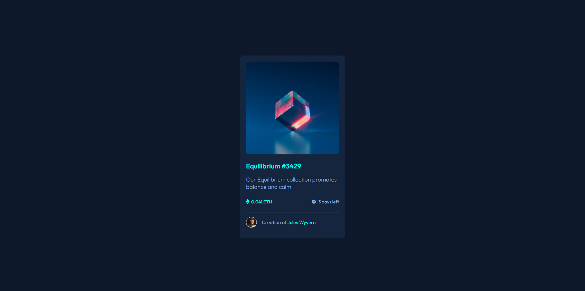

# Project Title

An NFT preview card component for a Frontend Mentor challenge.

## Tech Stack

**Client:** React

## Run Locally

Clone the project

```bash
  git clone https://github.com/hafezfhmi/nft-preview-card.git
```

Go to the project directory

```bash
  cd nft-preview-card
```

Install dependencies

```bash
  npm install
```

Start the server

```bash
  npm run start
```

## Screenshots



## Demo

https://nft-preview-card.hafezfhmi.com
